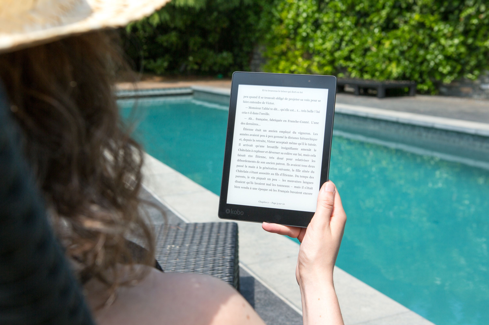

# Juntarattanakamol_Bondarchuk_midterm
This repo is for a midterm to arguing between Print-Book or E-Book.

## Installation

1. We created the repo and created the folder structure,
2. We created 2 branches for each members.
3. We added the information to the README.file.
4. We merged it to the main branch.
5. We created the conflict and resolution it.

## Usage

Can discribe the argument between Print-Book and E-Book.

## Contributing

1. Fork it!
2. Create your feature branch: `git checkout -b my-new-feature`
3. Commit your changes: `git commit -am 'Add some feature'`
4. Push to the branch: `git push origin my-new-feature`
5. Submit a pull request :D

## History

Friday 20 October, 2023

## Credits

Apapat Juntarattanakamol and Dina Bondarchuk

## License

MIT

